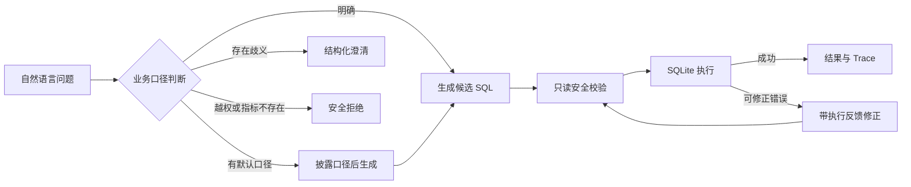

# DataQuery Agent

面向商业地产运营场景的可评测 Text-to-SQL 原型：先确认业务口径，再生成、校验和执行只读 SQL，并记录完整处理轨迹。

普通 Text-to-SQL 容易因指标口径歧义、字段幻觉和不友好的报错在业务场景中失效。本项目针对这三类问题，设计了可审计的行为路由、安全执行和错误修正链路。


## 核心设计



- **口径优先**：将问题路由为执行、披露后执行、澄清或拒绝，避免模型静默猜测。
- **只读防护**：语句预检、只读数据库连接和 SQLite authorizer 三层限制写操作。
- **可追踪纠错**：保存每次 SQL 尝试的阶段、错误类别、恢复状态、结果和耗时。
- **可复现评测**：合成数据、评测版本、Gold SQL、真实运行记录和构造测试分开管理。

## 已验证到什么程度

| 验证层 | 范围 | 当前结果 |
|---|---:|---|
| 数据与 Gold SQL | 6 张表、24 题、10 条 Gold SQL | 结构、业务约束和 Gold SQL 机械验证通过 |
| development 行为路由 | 16 题 | 16/16 动作符合预期，覆盖 11/11 主要规则 |
| Qwen 模型冒烟 | 2 条 development 查询 | 最终 2/2 匹配 Gold |
| 端到端真实运行 | 5 条可执行 development 查询 | 5/5 首次执行成功并严格匹配 v2.0.1 Gold |
| 自动化测试 | 路由、安全、纠错、Trace、UI 支撑层 | 43 项通过 |

这里的 `5/5` 只描述这 5 条 development 查询，不代表通用准确率。8 条留出题（holdout）仍保持冻结，未运行、不报告成绩；真实多轮纠错样本数仍为 0，纠错分支目前只通过构造场景的自动化测试验证。

完整证据、Bad Case 和未验证边界见[评测报告](docs/EVALUATION_REPORT.md)。

## 快速开始

核心验证需要 Python 3.11+；运行 UI 还需安装 `requirements.txt`。

```powershell
python scripts/generate_synthetic_data.py
python scripts/validate_phase1.py
python -m unittest discover -s tests -v
python scripts/evaluate_router.py
python scripts/route_query.py "上海上个月的收入是多少？"
```

启动默认离线 UI：

```powershell
python -m pip install -r requirements.txt
python -m streamlit run app.py
```

Demo 默认展示已保存、去敏的 development 运行记录，不调用模型。Live 模式需在启动前通过私有环境变量配置 Qwen API，并在页面中二次确认；不要把 Key 粘贴到页面或提交到仓库。详见[平台配置说明](docs/PLATFORM_SETUP.md)。

生成结果位于 `data/generated/`。SQLite 数据库不会提交到 Git，可随时由脚本重建；小型 CSV 数据保留用于人工查看。

## 仓库结构

```text
app.py                    Streamlit Demo
src/dataquery_agent/      路由、模型适配、SQL 防护、纠错与 Trace
data/                     Schema、指标字典、行为策略与合成数据
evaluation/               版本化题库、Gold SQL、真实运行记录
scripts/                  数据生成、验证、评测与命令行入口
tests/                    43 项自动化测试
docs/                     产品范围、架构、评测与公开边界
```

## 设计与证据文档

- [评测报告](docs/EVALUATION_REPORT.md)：结果证据、Bad Case 与尚未验证项
- [查询路由](docs/ROUTING.md)：四路行为判断和指标口径规则
- [执行及纠错链路](docs/PIPELINE.md)：SQL 生成、安全校验、执行与修正
- [数据 Schema](docs/SCHEMA.md)：六张业务表及其关系
- [产品范围](docs/PRODUCT_SCOPE.md)：目标用户、范围内能力和非目标
- [独立性与公开边界](docs/PROVENANCE.md)：数据、实现和结果声明边界

## 项目边界

本仓库是从空目录开始的独立实现。业务领域、表结构、字段、合成数据、指标字典、评测题和代码均为本项目重新设计，不包含任何第三方专有问数项目的代码、提示词、数据、截图或实验结果。

当前项目是本地原型，不宣称生产可用、企业落地、效率提升、通用准确率或优于商业产品。

## License

[MIT](LICENSE)
