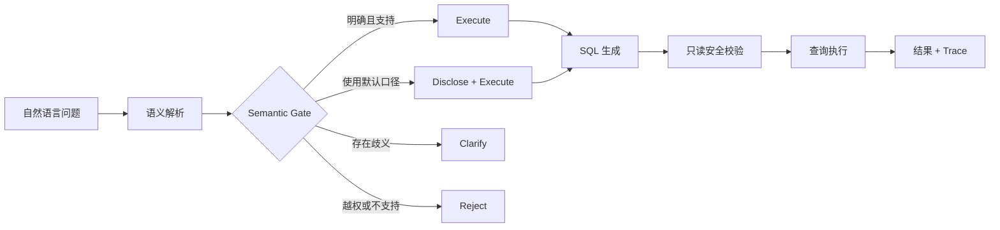

# DataQuery Agent

> An auditable AI data-analysis agent exploring how business users can ask data questions without silently inheriting the model's assumptions.

面向商业地产运营场景的 AI 数据分析 Agent 产品探索。项目重点不是“把自然语言翻译成 SQL”，而是解决真正阻碍业务用户使用 AI 问数的三个问题：**指标口径歧义、模型静默猜测，以及结果缺少可追溯证据**。


## Product Background

传统数据分析工具要求用户理解表结构、指标口径或 SQL。LLM 降低了提问门槛，却引入了新的产品风险：模型可能把模糊问题解释成某个指标并直接执行，返回“看起来合理、实际口径错误”的结果。

本项目围绕一个核心问题展开：

> 当用户的问题不够明确时，AI 应该回答、披露默认口径、追问，还是拒绝执行？

目标用户是需要快速获取经营数据、但不应承担数据库与 SQL 判断成本的业务人员。

## Product Solution

DataQuery Agent 将“理解问题”和“执行查询”拆成可审计的决策链：



- **Semantic Gate**：确定性代码拥有最终动作权，模型不能绕过澄清或拒绝规则。
- **业务口径优先**：用指标目录、同义词、歧义规则和显式披露约束查询行为。
- **Fail closed**：格式错误、覆盖不完整、未知指标和不安全请求不会进入 SQL。
- **只读执行**：SQL 预检、只读连接和 SQLite authorizer 共同限制写操作。
- **可审计 Trace**：记录解析尝试、动作、错误、token、耗时与恢复路径。

## Agent Workflow

1. 用户用自然语言描述数据问题。
2. Resolver 将原文拆分为查询目标、支持项、歧义项、不支持项与中性上下文。
3. Semantic Gate 检查完整覆盖、指标白名单、歧义规则和安全边界。
4. 系统选择 `execute`、`disclose`、`clarify` 或 `reject`。
5. 只有可执行请求才进入 SQL 生成、只读验证与数据库查询。
6. 结果与完整 Trace 一起返回，便于复盘 Bad Case。

## Product Iteration

| 阶段 | 发现 | 产品决策 |
|---|---|---|
| Phase 7 | 规则层可减少静默错误，但过度干预明显 | 不把开发集通过率当作产品可用性 |
| Phase 8 | 扩充词表无法可靠覆盖开放表达 | 从“枚举措辞”转向“模型理解 + 机械审查” |
| Phase 9A | 模型可能遗漏原文或错误声明请求类型 | 引入完整分段覆盖、写请求前置防护和 Gate 最终决策权 |
| Phase 9B | 模型提供字符 offset 容易造成机械失败 | 改为有序原文分段，由代码重建位置 |
| Phase 9B v2 | 真实冒烟仍出现静默执行歧义和过度干预 | 保留失败证据，不进入 SQL/用户测试，继续最小迭代 |
| Phase 9C | 歧义规则没有同时进入提示与机械判断 | 将 catalog 歧义指导注入 Resolver，并由 Gate 独立执行 |

完整产品案例见 [Product Case Study](docs/PRODUCT_CASE_STUDY.md)。

## Evaluation Highlights · 2026-10

| 产品验证 | 结果 |
|---|---:|
| 固定100题业务处理完整通过率（Max思考配置） | **93%** |
| 固定公式与参数化SQL的查询结果回放 | **70/70** |
| 历史57道同题、代码与模型共同升级 | **41 → 54题完整通过** |
| 同20题关闭思考的平均任务耗时 | **13.81s → 5.81s（降低57.9%）** |

本轮迭代从逐字规则转向结构化业务计划，集中解决过度澄清、时间排序、组内前N及已知条件保留。模型负责理解表达，后端负责固定指标公式与参数化执行。

100题由70道查询、20道澄清、10道库外请求组成；依据固定Gold逐题核对。质量与提速分别测量、分别报告，详细方法、版本及冻结指纹见 **[评测结果与测量方法](docs/EVALUATION_202610.md)**。

**[下载与验证93/100版本](releases/nl-v3-93/README.md)**：包含已测解析核心、固定公式后端、100题Gold、逐题输出和离线复算入口。**[版本更新](releases/nl-v3-93/CHANGELOG.md)** · **[性能优化实验](experiments/no-thinking-100/README.md)**

根目录保留历史Streamlit演示；新版可复核代码与评测包位于 `releases/nl-v3-93`，不会覆盖历史记录。

## Demo

默认 Demo 使用保存并去敏的 development 记录，不调用外部模型。

```powershell
python -m pip install -r requirements.txt
python -m streamlit run app.py
```

完整本地验证：

```powershell
python scripts/generate_synthetic_data.py
python scripts/validate_phase1.py
python -m unittest discover -s tests -v
```

Live 模式需要通过私有环境变量配置 Qwen API，并在界面中二次确认。不要把 API Key 粘贴到页面或提交到仓库。详见 [Platform Setup](docs/PLATFORM_SETUP.md)。

## Repository Structure

```text
app.py                    Streamlit 产品 Demo
assets/                   产品截图
src/dataquery_agent/      Resolver、Gate、路由、SQL 防护与 Trace
data/                     Schema、指标目录、行为策略与合成数据
evaluation/               冻结题集、协议与不可变运行结果
scripts/                  数据生成、验证、评测与运行入口
tests/                    演示版本自动化测试
docs/                     产品设计、架构、评测与阶段报告
```

## Key Documents

- [Product Case Study](docs/PRODUCT_CASE_STUDY.md)：用户问题、方案、迭代与证据边界
- [Verified Results](docs/VERIFIED_RESULTS.md)：可复核结果与声明口径
- [Phase 9B v2 Live Smoke Report](docs/PHASE9B_V2_LIVE_SMOKE_REPORT.md)：真实 development 冒烟与 Bad Case
- [Phase 9C Minimal Iteration](docs/PHASE9C_OFFLINE_MINIMAL_ITERATION_DESIGN.md)：Phase 9C 产品决策与实现范围
- [Routing](docs/ROUTING.md)：四路行为判断与指标口径
- [Pipeline](docs/PIPELINE.md)：SQL 生成、安全校验、执行与纠错
- [Product Scope](docs/PRODUCT_SCOPE.md)：目标用户、能力范围与非目标
- [Provenance](docs/PROVENANCE.md)：独立实现与公开边界

## Product & Technical Understanding

`LLM · Agent Workflow · Semantic Routing · Text-to-SQL · Prompt Engineering · Evaluation · Human-in-the-loop · SQL Safety · Product Prototyping`

这些技术只在其服务产品问题时出现：降低业务用户的数据访问门槛，同时让系统在不确定时能够解释、追问或停止。

## Project Boundary

本仓库是从空目录开始的独立实现。业务领域、表结构、字段、合成数据、指标目录、评测题与代码均由本项目重新设计，不包含第三方专有问数项目的代码、提示词、数据、截图或实验结果。

当前项目是本地原型，不宣称生产可用、企业落地、用户价值已验证、通用准确率或优于商业产品。

## License

[MIT](LICENSE)
