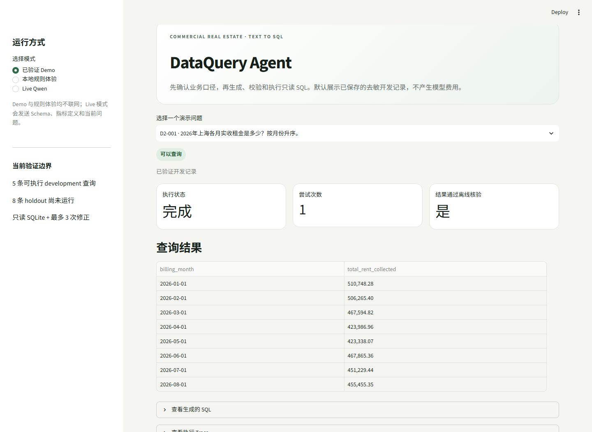

# DataQuery Agent

> 让非专业业务人员用自然语言查询商业地产经营数据。

围绕租金、出租率、租户和运营费用，完成“理解问题 → 确认口径 → 参数化查询 → 解释结果”的问数流程。产品重点是**降低提问门槛，同时让指标口径与执行结果可核对**。

## 最新成果

| 验证内容 | 测得结果 |
|---|---:|
| 固定100题业务处理完整通过率 · Max思考配置 | **93/100** |
| 固定公式后端的数值与清单结果回放 | **70/70** |
| 历史57道同题的整体版本升级 | **41 → 54题完整通过** |
| 同20题思考开/关的平均任务耗时 | **13.81s → 5.81s，降低57.9%** |

100题包含70道查询、20道必要澄清、10道库外请求，按固定Gold逐题核对。质量与速度实验分别计量；[测量方法](docs/EVALUATION_202610.md)包含配置、计算方式和复核说明。

**[最新版代码与评测包](releases/nl-v3-93/README.md)** · **[版本与数据索引](docs/VERSION_INDEX.md)** · **[迭代过程](docs/ITERATION_HISTORY.md)**

## 解决什么问题

业务人员能描述“想知道什么”，但不应先学习表结构、指标ID或SQL。系统将自然表达转换为目标、时间、筛选、分组与排序；已有信息充分时直接形成查询计划，真实口径未定时只追问必要条件。

新版采用职责分离：

1. **模型理解语言**：提取结构化业务计划，保留用户条件。
2. **代码校验计划**：核对指标、数据覆盖、时间和维度，不以逐字措辞决定可答性。
3. **固定后端执行**：指标公式与SQL结构由代码定义，日期、筛选值和数量使用绑定参数。
4. **结果可解释**：展示采用的口径、查询条件与处理记录。

主要迭代包括减少过度澄清、区分月份与金额排序、保留组内前N，以及完善单位和业务口径的澄清。[版本更新说明](releases/nl-v3-93/CHANGELOG.md)

## 验证最新版

Python 3.11+，以下离线验证仅使用标准库，不需要API Key：

```shell
cd releases/nl-v3-93
python -B verify_release.py
python -B -m unittest discover -p "test_*.py"
```

发布包包含100题与Gold、逐题保存输出、判定理由、后端参考结果、文件指纹及验证入口。随包68项测试通过；生成合成数据后的100题保存结果回放一致。具体生成与回放命令见[发布包说明](releases/nl-v3-93/README.md)。

## 产品演示



根目录Streamlit展示历史交互原型；新版解析与评测代码位于 `releases/nl-v3-93`。

```shell
python -m pip install -r requirements.txt
python -m streamlit run app.py
```

默认演示读取保存记录，不调用外部模型。[演示配置](docs/PLATFORM_SETUP.md)

## 阅读导航

| 想了解什么 | 入口 |
|---|---|
| 当前版本与每项数据对应关系 | [版本与数据索引](docs/VERSION_INDEX.md) |
| 93/100、同题提升与响应耗时如何测得 | [评测方法与结果](docs/EVALUATION_202610.md) |
| 最新版代码、案例与复算 | [NL-v3发布包](releases/nl-v3-93/README.md) |
| 从问题发现到方案调整 | [迭代历史](docs/ITERATION_HISTORY.md) |
| 关闭思考的质量与速度取舍 | [性能实验：91/100、平均5.09秒](experiments/no-thinking-100/README.md) |
| 早期产品设计与验证 | [历史产品案例](docs/PRODUCT_CASE_STUDY.md) · [历史验证报告](docs/EVALUATION_REPORT.md) |
| 项目来源与公开范围 | [Provenance](docs/PROVENANCE.md) |

个人AI产品原型，使用合成业务数据。最新成果以对应发布包及评测版本为准，历史记录保留用于追溯。

[MIT License](LICENSE)
